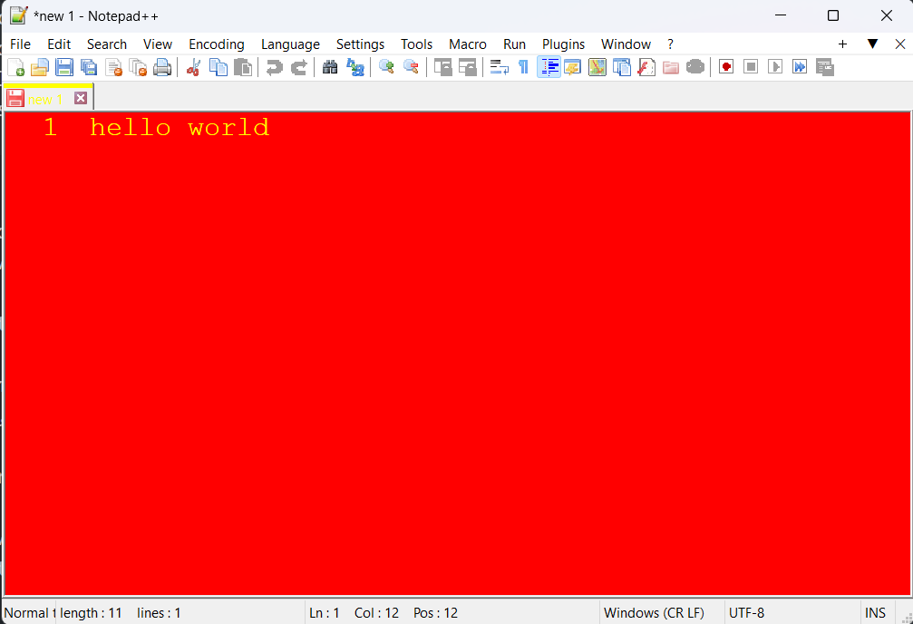

# notepad-plus-plus, but special version for nationalists



This is a joke, I think it's pretty fun.

If you run the project(get more detailed information below), you will find that the editor's background color has been modified to red, and the font color has been modified to yellow(just like the flag of PRC). And also it will keep playing the song 社会主义好(Socialism is good).

(unfortunately I don't know how to configure the visual studio project to make the music resources available on your computer without any effort. So I saved the music resources to the `red_song` folder and i hope you can manage it by yourself. Apologize for unconvienence.)

As you may know, the anthor and starter of the famous notepad-plus-plus project said some of words about the China. I DON'T want to judge whether it is wrong or not, but lots of people in China, especially in MainLand, hate this behaviour very much, they advocated to not to use this editor any more.

Again, I WON'T give my own opinion on such of things. I wrote this project ONLY for fun, to satisfy my own EVIL needs.

Hope you enjoy the project!

Please feel free to write emails to me at peler_little_pig@outlook.com if you have something to say or to ask.

## HOW TO RUN IT
1. clone this project, using the command below:
```bash
git clone https://github.com/PelerYuan/notepad-plus-plus.git
```
2. open `PowerEditor\visual.net\notepadPlus.sln` with `Microsoft Visual Studio 2022 version 17.5 (C/C++ Compiler, v143 toolset for win32, x64, arm64)`
3. Build Notepad++ solution like a normal Visual Studio project.
(By the way I recommend you to build the release version, becuase you may get a warning about the missing of some config file, if you build it in the debug mode, but it doesn't matter).
4. more information about the music resource configuration: 
the music file is in the `red_song` folder, and it has been configured in the `red_song.rc` in visual studio. REPLACE the `IDR_WAVE2` in it, and modify the code below from:
```cpp
PlaySound(LPWSTR(IDR_WAVE2), GetModuleHandle(NULL), SND_RESOURCE | SND_ASYNC | SND_LOOP);
```
into:
```cpp
PlaySound(LPWSTR(THE_NAME_OF_YOUR_NEW_RESOURCE), GetModuleHandle(NULL), SND_RESOURCE | SND_ASYNC | SND_LOOP);
```
tips: you can use global searching feature by the shortkeys `Ctrl+Shift+F`.

## TODO
- [X] build release


# Notepad-plus-plus，但是小粉红们的专属版本

这是个笑话，我觉得挺好玩的。

如果你运行这个项目（在下面获取更多详细信息），你会发现编辑器的背景颜色被修改为红色，字体颜色被修改为黄色（就像中华人民共和国的国旗一样）。而且它还会持续播放《社会主义好》这首歌。

（不幸的是，我不知道如何配置 Visual Studio 项目以使音乐资源在您的计算机上可用而毫不费力。所以我把音乐资源保存到了 `red_song` 文件夹，希望你能自己完成配置。为不便而道歉。

如你所知，著名项目 notepad-plus-plus 的作者人和发起人发表了一些关于中国的言论。我不想判断它是否错误，但很多人在中国，尤其是大陆，非常讨厌这种行为，他们主张不要再使用这个编辑器了。

同样，我不会对这样的事情发表自己的意见。我写这个项目只是为了好玩，以满足我自己的邪恶需求（就像地狱笑话一样）。

希望你喜欢这个项目！

随时给我写电子邮件：peler_little_pig@outlook.com

## 如何运行
1. 使用以下命令克隆此项目：
```
git clone https://github.com/PelerYuan/notepad-plus-plus.git
```
2. 使用 `Microsoft Visual Studio 2022 version 17.5 (C/C++ Compiler, v143 toolset for win32, x64, arm64)` 打开 `PowerEditor\visual.net\notepadPlus.sln`
3. 像普通的 Visual Studio 项目一样构建 Notepad++ 解决方案。
（顺便说一句，我建议您构建 release 版本，因为如果您在 debug 模式下构建，您可能会收到有关缺少某些配置文件的警告，但这并不重要）。
4. 有关音乐资源配置的详细信息：
音乐文件位于 `red_song` 文件夹中，并已在 Visual Studio 的 `red_song.rc`中配置。替换其中的 `IDR_WAVE2`，并修改以下代码，从：
```cpp
PlaySound(LPWSTR(IDR_WAVE2), GetModuleHandle(NULL), SND_RESOURCE | SND_ASYNC | SND_LOOP);
```
到：
```cpp
PlaySound(LPWSTR(新的音频资源名称), GetModuleHandle(NULL), SND_RESOURCE | SND_ASYNC | SND_LOOP);
```
提示：您可以使用全局搜索功能，通过使用快捷键组合`Ctrl+Shift+F`。

## 待办事项
- [X] 构建可执行文件